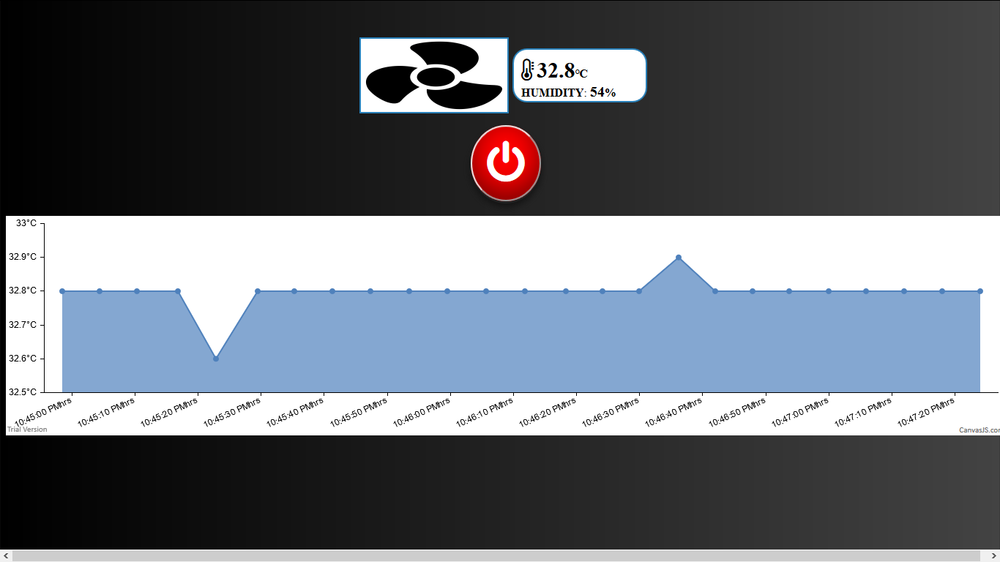
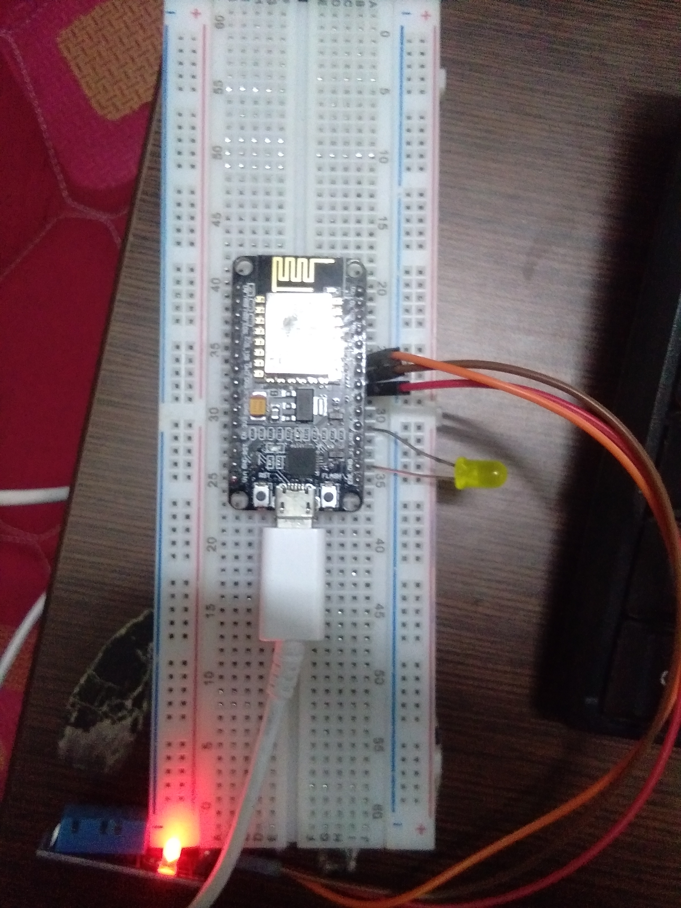

# IOT-temp-humdity
A project where dht sensor collect data &amp; show on web portol
 
Contributor :--  
Server --> NIKHIL JAIN 
Nodemcu --> SAMARTH GUPTA 
FrontEnd --> VAYUJ KANDOI 
<b>Instructions :--</b>
 
<ol>
  <li>Go to server folder via "CMD/TERMINAL"</li>
  <li>Configure database url in config.js</li>
  <li>type <b>npm install</b></li>
  <li>then type "npm start" to start</li>
  <li>Enter server address on node_mcu.ino file</li>
  <li>Set DHT sensor according to pin config in the file</li>
  <li>Enter wifi name & password in node_mcu.ino file</li>
  <li>Upload code on nodemcu</li>
  <li>Connect PC & nodemcu on same wifi</li>
</ol>
<h3>About project</h3>
 
<i>DHT sensor will give temperature & humdity data to nodemcu 
then data will send to server and upon request data will show  
on first page and button portol will control AC connect to  
nodemcu represented by LED</i>
 
<i>Project Sample pictures</i> 
<b>Portol Images</b> 
 
<b>Nodemcu images</b> 
 

